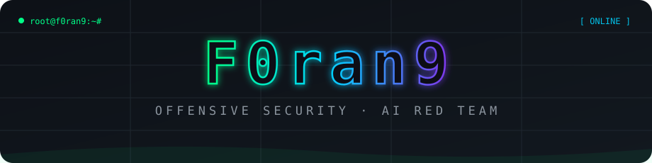

 

---

## 🎯 About / 关于

- 🔴 **红队 / 渗透测试** — Web 渗透 · API 安全 · 内网横向 · 权限提升 · 后渗透
- 🤖 **AI × 安全** — 打造多 Agent 自动化渗透平台：LLM Coordinator 编排专项子 Agent，侦察 → 漏洞检测 → 利用验证 → 取证报告全链路
- 🛡️ **攻防一体** — 左手攻击链，右手防线：POC 复现、检测规则、安全加固
- ⚔️ 热衷武器化研究与红队工具链建设，持续输出实战可复现的东西

## 🤖 [AI-PENTEST](https://github.com/F0ran9/AI-PENTEST) · 多 Agent 自动化渗透平台

> LLM 协调员编排专项子 Agent，在**授权边界内**自动完成 **侦察 → 漏洞检测 → 利用验证 → 取证 → 报告交付**，覆盖 Web 渗透与主机侧 C2 两条作业线。

| 板块 | 能力 |
|---|---|
| 🎯 **渗透任务主线** | 4 测试模式（standard / redteam / postexploit / safe）· 授权目标 scope · 11-Tab 任务详情（目标/漏洞/矩阵/记忆/思路/证据/运行/时间线/报告/日志/纠偏）· 实时 SSE 进度 · 预算守卫（软 100min / 硬 180min / 400 回合） |
| 🌐 **Web 渗透** | 爬虫侦察（JS 全覆盖模式）· SQLi / XSS / 命令注入 / LFI 检测 · IDOR 双会话比对 · 文件上传 Fuzz · 认证爆破 · CVE 查询（POC 真验证 + 误报治理）· 资产×漏洞热力矩阵 |
| 🕹️ **C2 控制** | HTTP / WS / TCP / DOH 多协议 Listener · Go / C# / Python 三系 Beacon · 载荷生成器（Python 模板开箱可用 + 预编 binary 配置 trailer）· 131 BOF 战术目录 · 拓扑图 · SOCKS5 / 端口转发 · 交互终端 · 文件管理 · RDP 屏幕 · Forwarder 级联 · AI Autopilot |
| 🔧 **Agent 工具箱** | 45+ 原生工具：Bash · Playwright 浏览器自动化 · 端口扫描（nmap/masscan/python 三引擎）· 目录扫描（生长字典 + AI 启发式扩词）· 截图取证 · 测试记忆 · RecordFinding · MCP 适配器 |
| 🗺️ **资产测绘** | FOFA / Hunter / Quake / Shodan 四源聚合测绘 · 资产自动入库联动任务 |
| 🧭 **攻击链可视化** | 资产 → 漏洞 → 利用 → 凭据 → 横向移动多层 DAG 自由画布（拖拽/缩放/鹰眼）· 原子测试矩阵三阶段流转 |
| 📚 **知识库** | 任务级知识蒸馏：漏洞库 · 测试记忆 · 经验总结 · 任务沉淀 · 文档库（MinIO）· 渗透路径生长字典（扫描命中自动入库持续进化） |
| 📦 **交付物** | 6 份制报告（漏洞总览 → Yakit 复测包）· 真实请求/响应包 · 分步复现卡 · 复现脚本（md/pdf/docx）· 证据截图三级溯源 |
| 🧠 **多模型融合** | GLM / DeepSeek / OpenAI / Kimi / Qwen 多 Provider · 按角色绑定（coordinator / subagent / report / assistant）· token 用量统计与限额 |
| ⚙️ **工程化** | PG 15 + Redis 7 + MinIO 状态持久 · Docker Solver 容器隔离执行 · Egress 出口代理（MITM 审计 + 目标白名单）· Scheduler / Worker / Reporter 分布式微服务（跨机扩展）· API Key 开放接口 + 滑动窗口限流 · 态势大屏 · 内置 CyberChef |
| 🛡️ **安全护栏** | 授权边界逐工具硬拦截 · 敏感操作二级审批 · 全路由审计 · 凭据脱敏 · 提示注入围栏 · 限流冷却 · 全平台防火墙（IP/CIDR/GeoIP） |

> ⚠️ 仅用于已授权的安全测试（渗透测试 engagements、CTF、安全研究、自有资产巡检）。

## 🛠️ Arsenal / 武器库

## 📊 GitHub Stats

## 🐍 Contribution Snake

  <a href="https://github.com/F0ran9/F0ran9">
    <picture>
      <source media="(prefers-color-scheme: dark)" srcset="https://raw.githubusercontent.com/F0ran9/F0ran9/output/github-contribution-grid-snake-dark.svg" />
      <source media="(prefers-color-scheme: light)" srcset="https://raw.githubusercontent.com/F0ran9/F0ran9/output/github-contribution-grid-snake.svg" />
      
    </picture>
  </a>

---

<i>Hack. Automate. Repeat. </i>⚡

